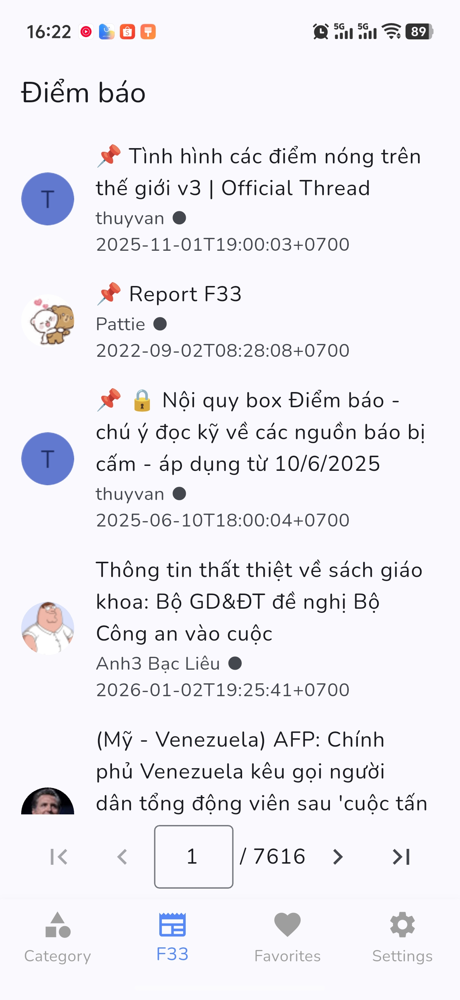
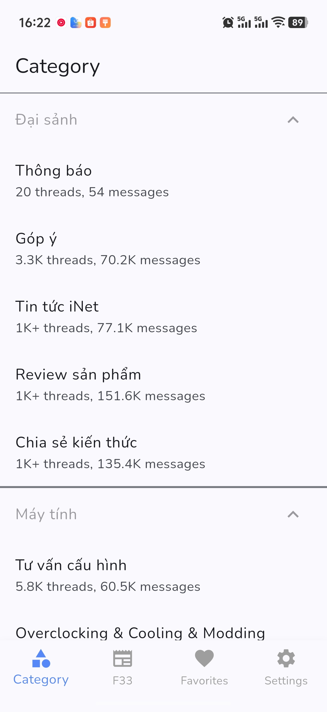
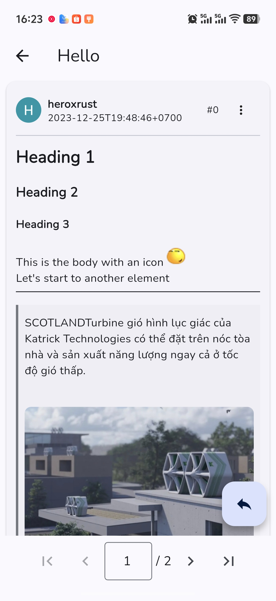
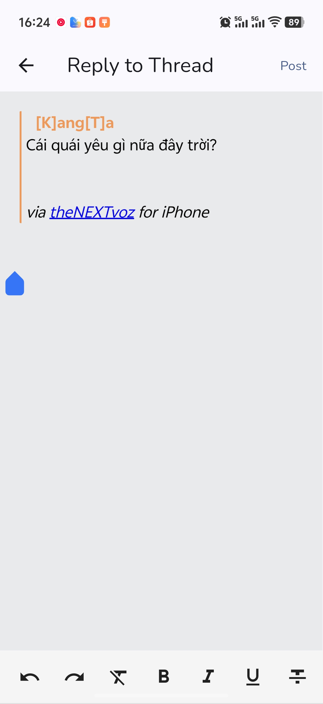
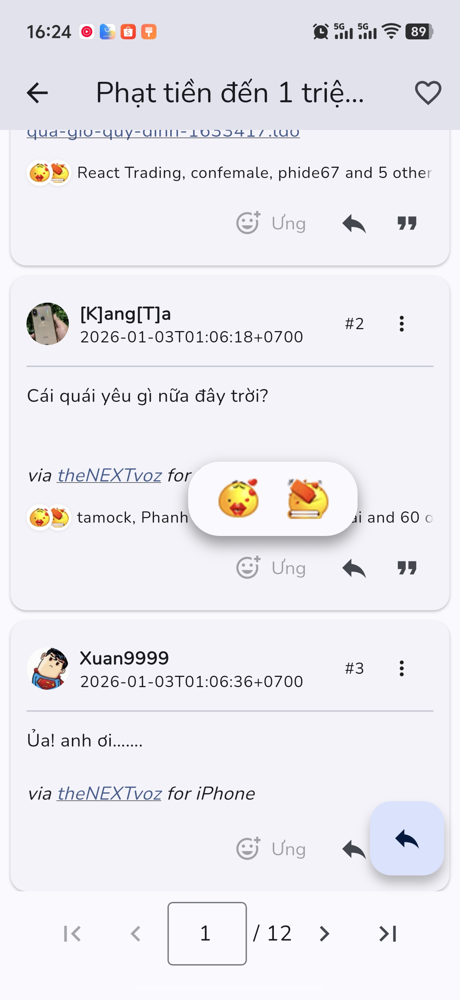

# Rusty Voz

**English** | [Tiếng Việt](README.md)

**Unofficial mobile client for Voz.vn**

## Introduction

Rusty Voz is an unofficial mobile application developed to provide the best experience when accessing [Voz.vn](https://voz.vn) - one of the largest online communities in Vietnam.

The app combines the power of **Flutter** for smooth user interface and **Rust** for high-performance networking and data parsing, delivering a true native-like experience.

Read my **devlog**: https://blog.iamqh.io.vn/posts/rusty-voz-devlog

## Key Features

### Login & Security
- :key: Username/password login
- :shield: Two-Factor Authentication (2FA) support
- :lock: Secure session management with secure storage

### Forum Browsing
- :newspaper: Browse posts by category (especially F33 - "Điểm báo")
- :books: Read threads and posts with optimized interface
- :page_facing_up: Smart pagination for efficient content loading

### Content Interaction
- :pencil2: Reply to posts with HTML-supported editor
- :heart: React to posts with emoji reactions
- :star: Save favorite posts to Favorites
- :speech_balloon: View and manage private messages (Conversations)

### Rich Content Display
- :art: Support for HTML, code blocks, spoilers, tables
- :frame_with_picture: Display images and embedded content
- :wrench: Code syntax highlighting
- :dark_sunglasses: Dark Mode for eye protection

### Performance
- :rocket: Rust backend for ultra-fast networking and parsing
- :zap: Image and content caching
- :battery: Optimized for battery and data usage

## Screenshots

| F33 | Categories | Threads |
|--------|------------|-------------|
|  |  |  |

| Reply | React | Conversations |
|---------------|--------------|-----------|
|  |  |  |

## Download

### Android

The latest version will be available in the [Releases](https://github.com/iampqh/rusty-voz/releases) section.

### iOS

Coming soon...

## System Requirements

- **Android**: Android 5.0 (Lollipop) or higher
- **iOS**: iOS 12.0 or higher (coming soon)

## How to Use

1. Download and install the app from [Releases](https://github.com/iampqh/rusty-voz/releases)
2. Open the app and log in with your Voz.vn account
3. If you have 2FA enabled, the app will prompt for verification code
4. Start exploring and interacting with the Voz.vn community!

## Reporting Issues

If you encounter any issues or want to suggest new features, please create an issue:

- [Report a Bug](https://github.com/iampqh/rusty-voz/issues/new?template=bug_report.md)
- [Request a Feature](https://github.com/iampqh/rusty-voz/issues/new?template=feature_request.md)

When creating an issue, please provide:
- App version you're using
- Device and operating system
- Detailed description of the problem
- Screenshots or error logs (if applicable)

## FAQ

**Is Rusty Voz an official Voz.vn app?**

No, this is an unofficial app developed by the community.

**Is the app free?**

Yes, Rusty Voz is completely free.

**Do I need a Voz.vn account to use the app?**

You can view public posts without logging in, but you need an account to interact (post, comment, etc.).

## Disclaimer

- Rusty Voz is not affiliated with or endorsed by Voz.vn
- Voz and its logo are property of their respective owners
- The app complies with Voz.vn Terms of Service

## Contact

If you have any questions, reach out via:
- GitHub Issues: [github.com/iampqh/rusty-voz/issues](https://github.com/iampqh/rusty-voz/issues)

---

Made with :heart: by iamqh

**[⬆ Back to Top](#rusty-voz)**

